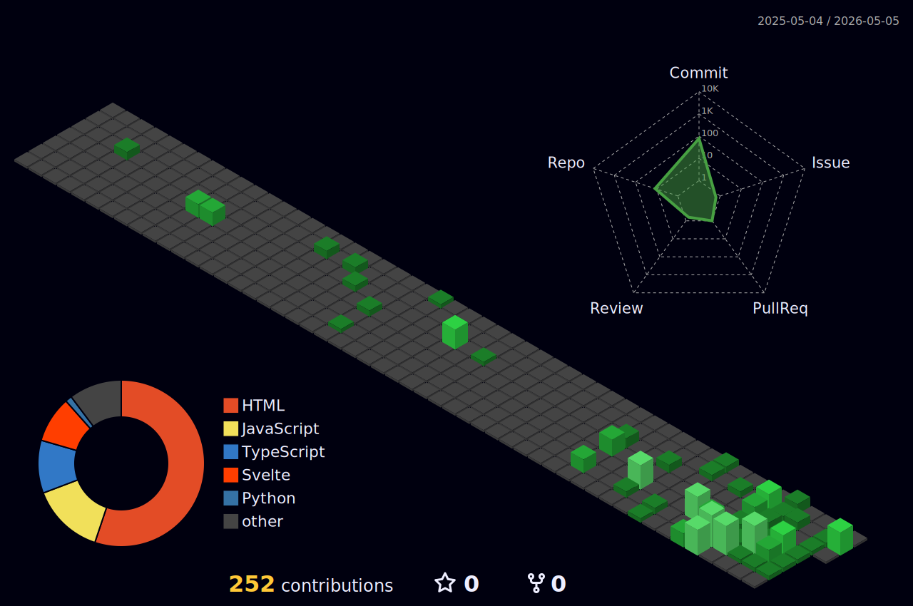

<div align="center">

```
@@@@@@@@@@@@@@@@@@%@@@@@@@%@@@@@@@@@%@@@%@%@@%%@%%%@@%%%@%%%%%%%%%%
@@@@@@@@@@@%@@@@@@@@@@@@%@@@@@@@@@@@@@@@@%%%%%%%%%@@%%%@%%%%%%%%%%%%
@@@@@@@@@@@@@@@@@@@@@@@@+@@%@%@*@@@%@@@@@%%%@@%%%%%%%%%+%@+%%%%%%%%
@@@@@@@@@@@@@@@@%%%@@%%*%%%@%%@@@@%@@@@@@%%%%%%%%%%%%%@@%%%%%%%%%%%%
@@@@@@@@@@@@@@@@@@%%%%%%%%%%%%%%#%@@%@%%@%%%%%%%%%%%%%%%%%%%%%%%%%%#
%@@@@@@@@@@@@@@@%%%%%%%%%%%%%%%%%@%@%@%@%@@@%%%%@%%%%#%%%%%%%%%%%%%*
@@@@@@@@@@@@@@@@@@%%%%%%%%%%%%%%%%%%%%%*%%%%%%%%@%%%%%%%%%%%%%%%%%%@
@@@@@@@@@@@@%@@@@@%%%%%%%%%%%%%%%%%%%%%%%%%%%#%%%*%%%%%%%%%%%%%%%%%@
@@@@@@@%@@@@%@@@%@%%%%%%%%%%%%%%%%%%%%%%%%%%%%%%%%%%%%%%%%%%#%%%%%%
@@@@@@@@@@@@@@@@@@@%%%@%%%%%%%%%%%%%%%%%%%%%%%%%%%%%%%%%%#%%%%#%%%%
@@@@@@@@@@@@@@@@@@%@%%%#%%%%%%%%%%%%%%%%%%%%%%%%%%%%%%%%%%%%%#%####
@@@@@@@@@@@@@@@@@@%%@%%%%%%%%%@%%%%%@%%%%%%%%%%%%%%%%#%%%%%%%%####*
@@@@@@@@@@@@@@@@@%@@%%%%%%%%%%%%%%%%%%%%%%%%%%%%%%%%%%%%%%%%%%%%###
@@@@@@@@@@@@@@@@@@%@%%%%%%%%%%%%%%%%%%%%%%%%%%#%%%%%%%%%%%%%##%##*#
@@@@@@@@@@@@@@@@@@%@%%%%%%%%%%%%%%%%%%%%%%%%%%%%%%%%%%%%%%%%%%##%##
@@@@@@@%@@@@@@@@@@%%%%%%%%%%%%%%%%%%%%%%%%%%%%%%%%%%%%%%%%#*%%##*##
@@@@@@@@@@@@@@@@@@@@%%%%%%%%%%%%%%%%%%%%-%%%%%%%%%%%%%%%%%%%%%#####
@@@@@@@@@@@@@@@@@@@%%%%%%%#%%%%%%%%%%%%%%%%%%%%%%%%%%%%%%%%%%%%%###
@@@@@@@@@@@@@@@@@@@@%%%%%%%%%%%%%%%%%%%%%@%%%%%%%%%%%%%%%%%%%%%%%%%%%
@@@@@@@@@@@@@@@@@@@@%%%%%%%%%%%%%%%%%%%%%@%%%%%%%%%%%%%%%%%%%%%%%%%%%
@@@%@@@@@@@@@@@@@@@%%%%%%%%%%%%%%%%%@%%%%%%%%%%%%%%%%%%%%%%%%%%*%%###
@@@%@%%%%@@@@@@@@@%%%%%%%%%%%%%%%%%%%@%%%%%%%%%%%%%%%%%%%%%%%%%%%%*%%
@@@@@%@%%#%%%%%%%%%%%%%%%%%%%%%%%%%%%@%%%%%%%%%%%%%%%%%%%%%%%%%%##%%#
@@@@@%%%%%%%%%%%%%%%%%%%%%%%%%%%%%%%%%%%%%%%%%%%%%%%%%%%%%%%%%%#%##%
@@@@%%%%%%%%%%%%%%%%%%%%%%%%%%%%%%%%%%%%%%%%%%%%%%%%%%%%%%%%%%######
@@@@%@%%%%%%%%%%%%%%%%%%%%%%%%%%%%%%%%%%%%%%%%%%%%%%%%###*#####%####
@@%%@%%%%%%%%%%%%%%%%%%%%%%%%%%%%%%%%%%%%%%%%%#%########%######*####
@@%@@%%%%@%%%%%%%%%%%%%%%%%%%%%%%%%%%%%%%%%#%##########*##*#########
```


<br>


</div>


```yaml
name: brixxou
role: DevOps / AI Engineer
location: Rouen, France
focus: Infrastructure, Automation, Intelligent Systems
motto: "build. deploy. iterate. repeat."
```

<div align="center">


</div>


<div align="center">
<table>
<tr>
<td width="50%" valign="top">

### DevSecOps Pipeline
```
├── security-first CI/CD
├── automated vulnerability scanning
├── infrastructure as code
└── zero-trust deployment
```
`Docker` `GitHub Actions` `GCP` `K8s`

</td>
<td width="50%" valign="top">

### Dual Agent
```
├── multi-agent AI system
├── autonomous task execution
├── intelligent orchestration
└── adaptive decision making
```
`Python` `AI` `Agents`

</td>
</tr>
</table>
</div>


<div align="center">



</div>


<div align="center">

<a href="https://lesage.agency">

</a>

```
░▒▓ built different. deployed everywhere. ▓▒░
```


</div>
