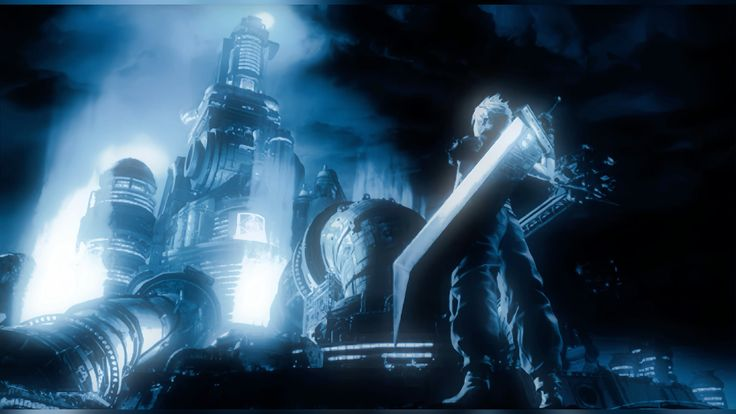

<p align="center">

<br>

</p>

<table>
  <tr>
    <td width="50%" valign="top">
      
      <br>
      <div align="center">

```yaml
name: brixxou
role: DevOps / AI Engineer
location: Rouen, France
focus: Infrastructure, Automation
motto: "build. deploy. iterate."
```


<a href="https://lesage.agency">

</a>

</div>
    </td>
    <td width="50%" valign="top">

### DevSecOps Pipeline
```
├── security-first CI/CD
├── automated vulnerability scanning
├── infrastructure as code
└── zero-trust deployment
```
`Docker` `GitHub Actions` `GCP` `K8s`

---

### Dual Agent
```
├── multi-agent AI system
├── autonomous task execution
├── intelligent orchestration
└── adaptive decision making
```
`Python` `AI` `Agents`

---

<div align="center">


</div>

</td>
  </tr>
</table>

<div align="center">

```
░▒▓ built different. deployed everywhere. ▓▒░
```

</div>
